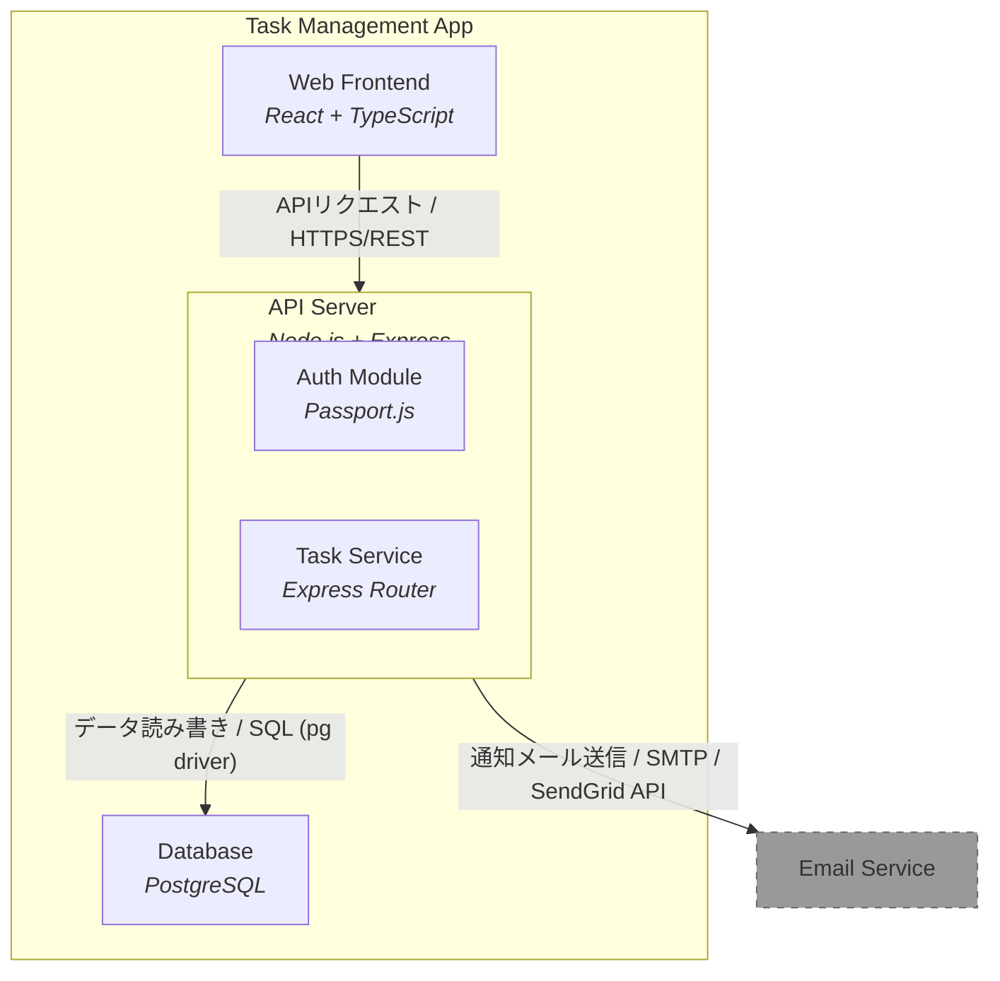

# Architecture Overview

## Component Structure

## Component List

| Level | Count |
|-------|-------|
| Systems | 2 |
| Containers | 3 |
| Components | 2 |

---

*Generated by [Architecture Tracker](https://github.com/kenkenji/architecture-tracker)*
